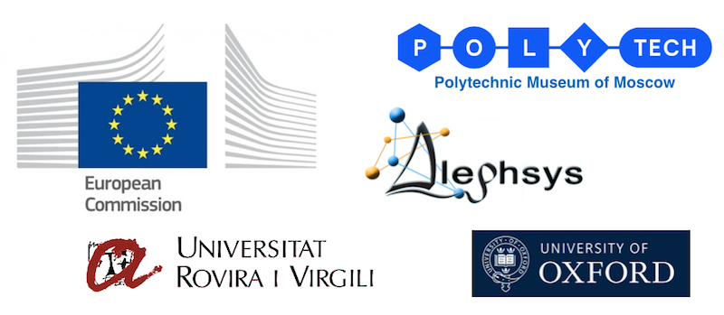

Credits
=========

This work has been partially supported by European Commission FET-Proactive project [PLEXMATH (Grant No. 317614)](<http://www.plexmath.eu/>), the European project devoted to the investigation of multi-level complex systems and has been developed at the [Alephsys Lab](<http://deim.urv.cat/~alephsys/>),

I am in debt with Alex Arenas for proposing this project, with Mason A. Porter and the members of the Alephsys Lab for invaluable suggestions and feedbacks. 

I would like to thank Inderjit S. Jutla, Lucas G. S. Jeub, and Peter J. Mucha for making their code about multislice community detection available. 

I would like to thank Martin Rosvall for allowing to distribute his C++ code for Multiplex Infomap under the AGPLv3 license.

The development of muxViz has been funded, or is currently funded, by the following entities and institutions:

I would also like to thank the following people for their unvaluable (voluntary) support to muxViz and parts of its development:

- Lucio Agostinho Rocha
- Francesc Font
- Patricia Gonçalves
- Kim Klark
- Sneha Rajen
- Maria Pereda
- Hiroki Sayama
- Tzu-Chi Yen
- Rafael Pereira
- Yuriko Yamamoto
- Rodrigo García
- Sergio Alcalá-Corona
- Guillermo de Anda Jáuregui
- Giulia Bertagnolli
